# Quiz-bot discord
A discord bot created during a Player's Bank job.
The goal was to organize an event on the Player's Bank Discord server with gift card prizes for the winners.

## Technology 

Here are the technologies used in this project.

* Discord.js version 13.6.0
* Sequelize version 6.18.0
* Mysql 2.3.3

## Getting started

1 - Install dependencies: 

[Install Nodejs](https://nodejs.org/)

2 - Clone the repository running into your terminal:

```sh
git clone https://github.com/ppkat/quizBot-discord.git
```

3 - Install the required packages using:

```
npm i
```

## How to use

### 1 - First you need to create your bot on [discord API](https://discord.com/developers)

### 2 - When you get your bot token, you must create a .env file on the root of the project.

The .env file should have 6 environment vars:

```
BOT_TOKEN="your token goes here"
CLIENT_ID="yout yoke id"
DISCORD_SERVER_ID="discord guild id"
DATABASE_NAME="database name"
DATABASE_HOST="localhost"
DATABASE_PASSWORD="database password"
```

### 3 - After put your bot on your server, you must run the "deploys-commands.js" file to register the slash commands on discord server.

### 4 - Then run index.js file and the bot goes up!

## Features

### Commands:

 #### **1. Quiz**
 The main command. This represents the game and encompasses 80% of the bot's functionality.

 ##### 1.1 The command have 5 parameters

 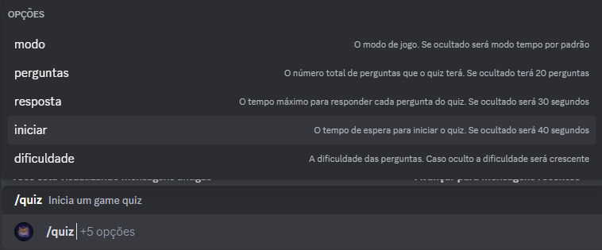

 ##### 1.2 The first one (modo) is the game mode that will be played. There are two game modes: "tempo" and "primeiro". In the "tempo" mode, the bot will wait for the time given in the parameters before moving on to the next question. Additionally, all correct answers will be deleted, and points will be awarded to participants based on the number of people who have already answered correctly. Otherwise, in the "primeiro" mode, only the first correct answer will be awarded. If omitted the default mode is "tempo"

 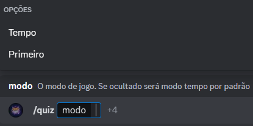

 ##### 1.3 The second parameter is "perguntas" and it refers to the total number of questions that the quiz will have. Default: 20 questions

 ##### 1.4 Next parameter is the "reposta" which is the time in seconds that each question have to be answered util moving on to the next question. When omitted, questions will have 30 seconds for answers

 ##### 1.5 The "iniciar" parameter is the time that the game will wait to start. The Default is 40 seconds in case it is omitted.

 ##### 1.6 Lastly, the "dificuldade" parameter will determine the game difficulty (easy, medium or hard). When occulted, the game will operate with progressive difficulty: the firsts 1/3 of the question will be easy, the next 1/3 will be medium and the last 1/3, hard.

 After executing the command, an embedded message will appear, displaying all the game configurations: round time, time for start (real-time countdown), game mode, number of questions, and participants (real-time change). At the bottom of the embed, several reactions will appear, and to subscribe to the quiz and become a participant, simply react to any of those reactions. When the start time reaches 0, the game will begin, and the category of the questions will be the one with the most votes from the reactions.

 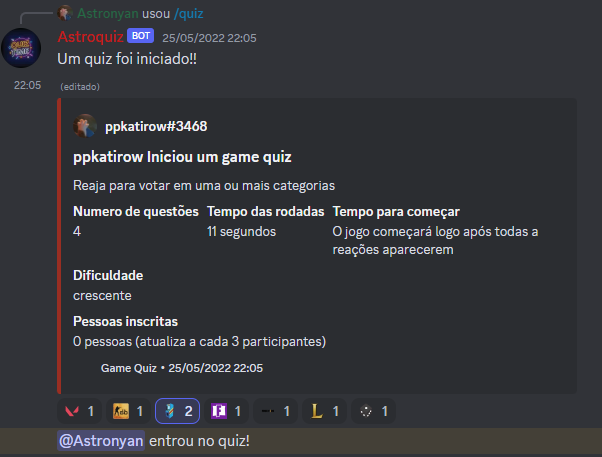

 Then  the bot will present the first question through an embedded message:

 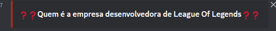

 If a participant writes anything other than the correct answer, their message will be reacted to with "❌":

 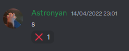

 However, if a participant writes the correct answer, they will be rewarded with points, and the result will be displayed like this:

 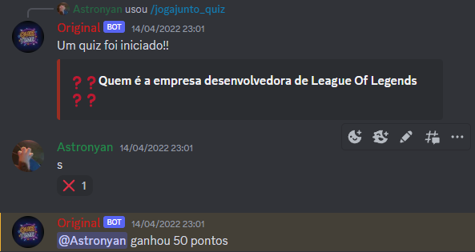

 Once the round time is up or all the participants provide the correct answer (or if the first participant provides the correct answer in the case of "primeiro" mode), the bot will reveal the correct answers and list all the participants who answered correctly. Then, the bot pass to the next round.

 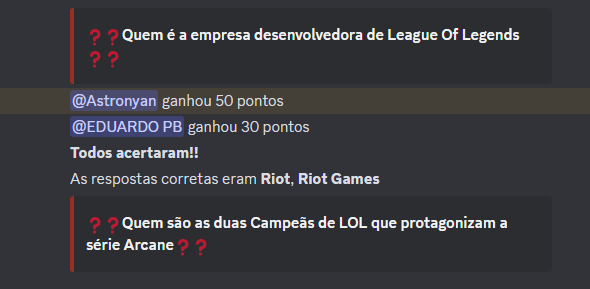

 During the quiz, some images are displayed to show the participants how much time they have left to answer:
 
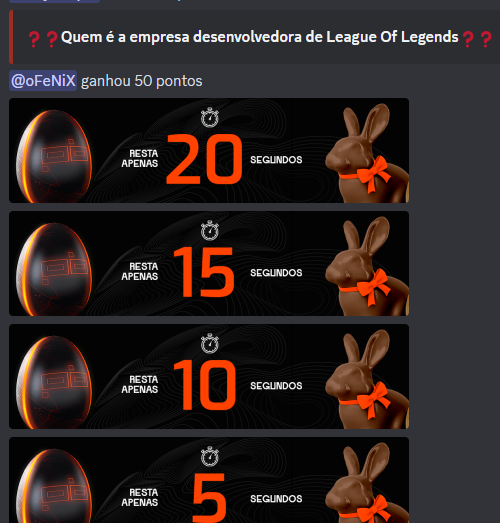

At the quiz end, an embed is displayed showing the winner and the total score of first 10 participants. All scores also is stored on the database

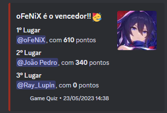

 #### **2. Rank**
 The "Rank" command displays the leaderboard, showing the top 100 highest scores as shown in the embedded message below:

 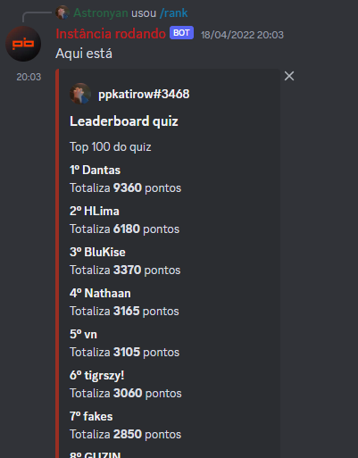

 If you pass a mention of a specific user with the "@user" format in the parameter, you can see the score of that particular user.

 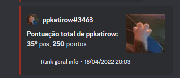

 #### **3. Post**
 Add a question to the quiz. Users can pass the question, possible answers separated by commas, the category of the question, and the difficulty level. This way, the quiz can easily grow, and users can contribute questions as they desire.

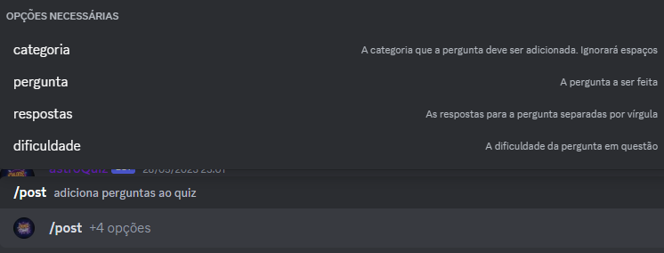

The users who can use this command can be defined in the config.json file, allowing you to specify which users have the privilege to add questions to the quiz.

  ## Authors

  * **João Pedro Gaspar Pereira** 

  Please follow github and give me a star if you like the project!
  I am always open to suggest so feel free to give me ideas or contribute!